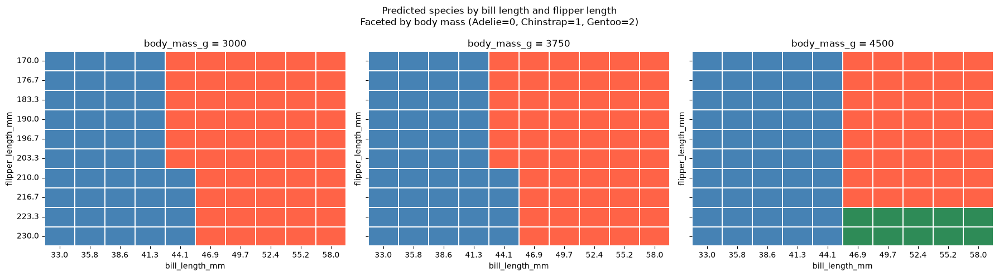

# Project Documentation

This site provides project documentation.
Use the documentation navigation to explore.

## How-To Guide

Many instructions are common to all our projects.

See
[⭐ **Workflow: Apply Example**](https://denisecase.github.io/pro-analytics-02/workflow-b-apply-example-project/)
to get the example projects running on your machine.

## Project Documentation Pages (docs/)

- **Home** - this documentation landing page
- [**Project Instructions**](./project-instructions.md)  - the standard project workflow
- [**Your Files**](./your-files.md) - how to copy the example and create your version
- [**Glossary**](./glossary.md) - project terms and concepts
- [**API**](./api.md) - autogenerated code documentation for the public project interface

## Phase 4. Technical Modification

The technical modification changed the fixed record used in the Section 3
feature-sensitivity test from the Adelie baseline (`BASELINES[0]`) to the
Chinstrap baseline (`BASELINES[1]`). The API endpoint, feature being swept,
range of 20 bill-length values from 30 to 60 mm, plotting code, prediction grid,
and edge-case tests were unchanged.

With the Adelie baseline, the predicted species changed from Adelie to
Chinstrap at the tested bill length of 42.63 mm. With the Chinstrap baseline,
42.63 mm still produced Adelie and the first Chinstrap prediction occurred at
44.21 mm. The observed transition therefore moved upward by one grid interval,
approximately 1.58 mm. Neither sweep produced a Gentoo prediction.

The modified notebook completed all API calls and produced the updated sweep
table and chart. The later two-feature prediction grid and edge-case outputs
were unchanged in the executed results.

## Phase 5. Custom Project

### Basis and API

The custom investigation retained the example penguin model and the deployed
prediction endpoint:
`https://ml-penguin-predictor.onrender.com/predict`. The model performs
supervised multiclass classification and returns one of three species labels:
Adelie, Chinstrap, or Gentoo.

The endpoint accepts a JSON object containing four numeric measurements:
`bill_length_mm`, `bill_depth_mm`, `flipper_length_mm`, and `body_mass_g`. The
three supplied baseline records were predicted as their expected species,
confirming an Adelie, Chinstrap, and Gentoo response before the investigation
continued. The custom notebook kept the same endpoint, model, target, and input
contract.

### Investigation Approach

The one-feature test varied `bill_length_mm` across 20 evenly spaced values from
30 to 60 mm while holding the Chinstrap baseline's other three measurements
fixed. The original two-feature grid then tested 10 bill lengths from 33 to 58
mm against 10 flipper lengths from 170 to 230 mm, producing 100 combinations
while retaining the baseline bill depth and body mass.

The custom Section 4 cell added `body_mass_g` as a third varied feature. It
repeated the 10-by-10 bill-length and flipper-length grid at body masses of
3000, 3750, and 4500 g, producing 300 predictions and a separate heatmap for
each mass. The investigation also sent five missing, extreme, negative, or zero
input cases to the endpoint.

The executed chart identifies the three mass values, but the saved notebook
does not define the `body_mass_values` variable before the added cell. A fresh
top-to-bottom execution would require that list to be defined in the notebook.

### Findings: Feature Sensitivity

In the one-feature sweep, predictions were Adelie from 30 through 42.63 mm and
Chinstrap from 44.21 through 60 mm. This places the tested bill-length boundary
between 42.63 and 44.21 mm when the other inputs are fixed at the Chinstrap
baseline values.

In the two-feature grid at the baseline mass of 3500 g, the Adelie-to-Chinstrap
transition depended on flipper length. For flipper lengths from 170 through
203.3 mm, the change occurred between bill lengths of 41.3 and 44.1 mm. For
flipper lengths from 210 through 230 mm, it occurred between 44.1 and 46.9 mm.
No tested combination in that grid produced Gentoo.

The 3000- and 3750-g facets in the added grid had the same predictions at all
100 tested bill/flipper combinations. At 4500 g, bill lengths through 44.1 mm
remained Adelie. Bill lengths of 46.9 mm and above produced Chinstrap for
flipper lengths through 216.7 mm and Gentoo for flipper lengths of 223.3 and
230 mm. Body mass therefore changed the tested decision surface at 4500 g and
introduced a Gentoo region for the longest flippers and longer bills.

### Findings: Edge Cases

The payload missing `body_mass_g` received an HTTP 400 Bad Request response.
The API returned classifications rather than validation errors for the four
numerically complete but implausible inputs: a 1-mm bill was classified as
Adelie, a 999-mm bill as Chinstrap, a negative 10-mm bill as Adelie, and zero
body mass as Adelie.

These responses show that the endpoint checks for required fields but does not
reject the tested out-of-range numeric values. The returned species for those
values are model extrapolations outside realistic penguin measurements.

### Summary

The custom notebook probed the deployed penguin classifier through repeated API
requests without changing the model or endpoint. It verified three baseline
predictions, measured a one-dimensional bill-length transition, mapped a
two-dimensional bill/flipper decision surface, extended that surface across
three body masses, and recorded the endpoint's responses to five edge cases.

The results show that the predicted species depends on interactions among bill
length, flipper length, and body mass. The added 4500-g facet produced a Gentoo
region that was absent at 3000 and 3750 g. The edge-case results also distinguish
missing-field validation from numeric range validation: the former returned an
error, while the tested unrealistic numeric values were accepted and
classified.

